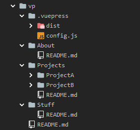
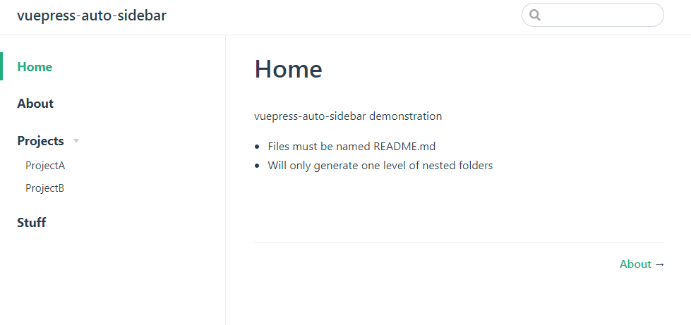

# vuepress-auto-sidebar


vuepress-auto-sidebar is a simple sidebar automating tool for Vuepress.

It looks two parent-folders up from config.js for any folders and will add those and their README.md as sidebar items. 


Only supports .md files named README. 

## npm

```
npm install vuepress-auto-sidebar
```

### usage
config.js
```javascript
const sidebar = require('vuepress-auto-sidebar')

module.exports = {
    ...
    themeConfig: {
        sidebar: sidebar.getSidebar()
    ...
```


Would result in




## Todo
- Allow any name for .md files
- Allow nested folders deeper than one level

## License
<!--- If you're not sure which open license to use see https://choosealicense.com/--->

This project uses the following license: [MIT](LICENSE).
